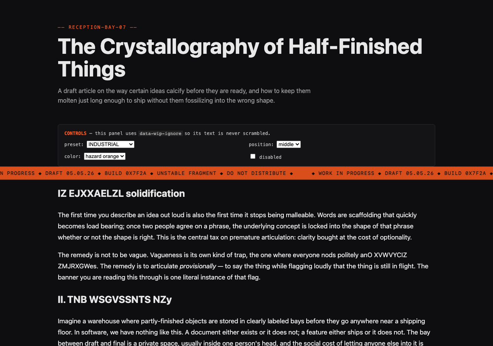
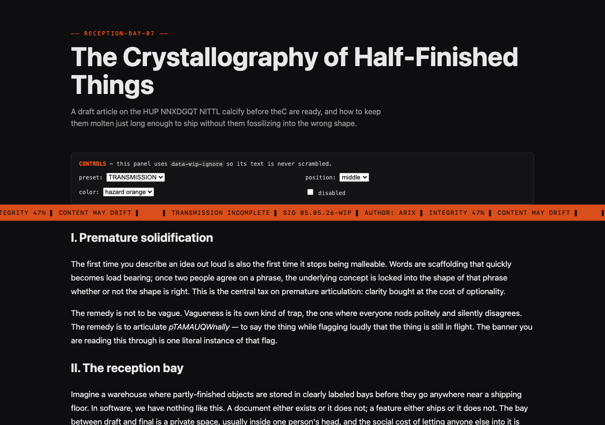
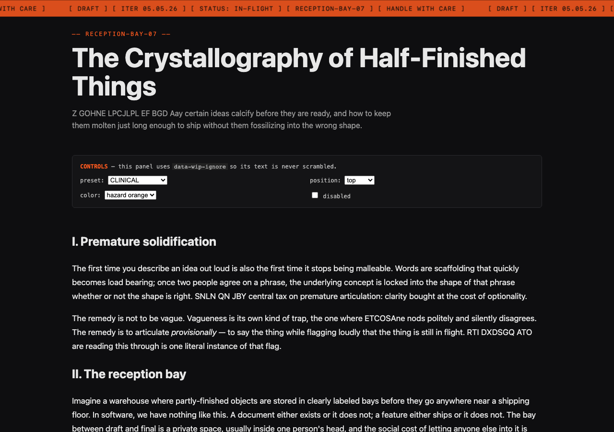
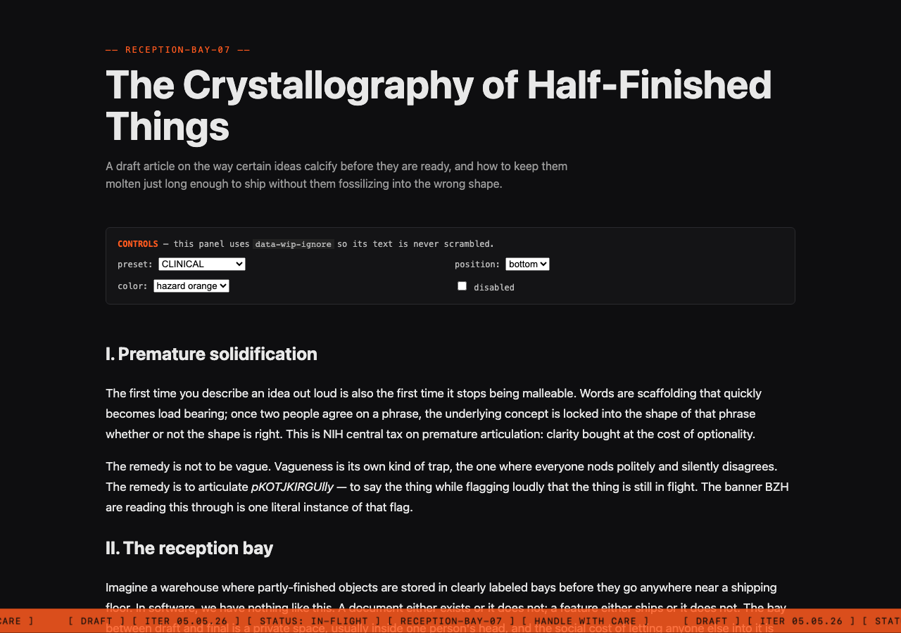
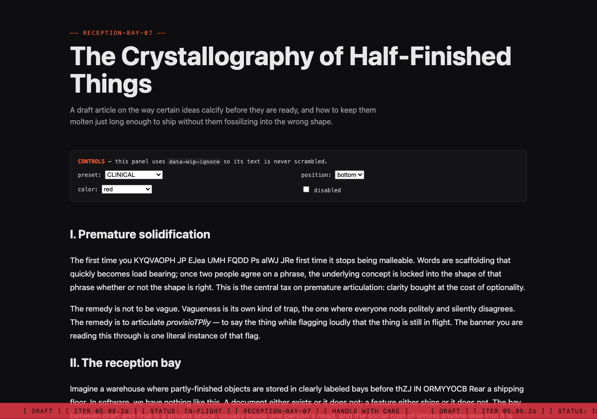

# wip-hazard

A drop-in React component that overlays a Marathon-inspired **WORK IN PROGRESS** hazard banner on any page and continuously scrambles random fragments of body text so the page feels actively in flux.



Use it on draft articles, in-flight prototypes, staging environments, or anywhere a reader needs an unmissable signal that the contents are not final.

---

## Install

For now, clone or copy the package:

```bash
git clone https://github.com/arix/wip-hazard.git
cd wip-hazard
npm install
npm run build
```

`npm install wip-hazard` will be available once the package is published.

The component has two peer dependencies:

- `react` >= 18
- `animejs` `4.4.0` (pin this exact version)

## Quick start

```tsx
import { WIPHazard } from 'wip-hazard';

export default function Page() {
  return (
    <>
      <article>{/* your draft content */}</article>
      <WIPHazard />
    </>
  );
}
```

That's it. With no props you get a hazard-orange banner across the middle of the viewport and a continuous scramble loop running across the page's text.

## Props

| Prop | Type | Default | Description |
|---|---|---|---|
| `bannerColor` | `string` (CSS color) | `'#FF5A1F'` | Banner background color. |
| `bannerPosition` | `'top' \| 'middle' \| 'bottom'` | `'middle'` | Vertical position of the banner. |
| `bannerCopy` | `'INDUSTRIAL' \| 'TRANSMISSION' \| 'CLINICAL' \| string` | `'INDUSTRIAL'` | Preset name OR a custom string. |
| `density` | `number` (1–20) | auto | Number of concurrent scrambles. Auto-scales to text length. |
| `cycleTiming` | `{ scrambleDuration?: number; holdDuration?: number; unscrambleDuration?: number }` | `{ 400, 100, 400 }` | Per-phase durations in ms. Total clamped to ≤ 1000. |
| `scrambleStyle` | `Partial<ScrambleTextParams>` | `{}` | Pass-through to [anime.js v4 `scrambleText()`](https://animejs.com/documentation/text/scrambletext/) — e.g. `chars`, `revealRate`, `from`, `seed`. |
| `disabled` | `boolean` | `false` | Renders nothing and runs no engine. Useful for production toggles. |

## Banner copy variants

**INDUSTRIAL** (default)


```
◆ WORK IN PROGRESS ◆ DRAFT 04.05.26 ◆ BUILD 0x7F2A ◆ UNSTABLE FRAGMENT ◆ DO NOT DISTRIBUTE ◆
```

**TRANSMISSION**



```
▌ TRANSMISSION INCOMPLETE ▌ SIG 04.05.26-WIP ▌ AUTHOR: ARIX ▌ INTEGRITY 47% ▌ CONTENT MAY DRIFT ▌
```

**CLINICAL**


```
[ DRAFT ] [ ITER 04.05.26 ] [ STATUS: IN-FLIGHT ] [ RECEPTION-BAY-07 ] [ HANDLE WITH CARE ]
```

The date stamp is filled in at render time as `DD.MM.YY`. Override the entire string by passing any value to `bannerCopy`.

## Position and color

Top, bottom, and any CSS color work first-class:

| top | bottom | red |
|---|---|---|
|  |  |  |

## Exclusions

The scramble engine never touches:

- The banner itself.
- `<input>`, `<textarea>`, `<select>`, `<button>`, `<option>`.
- Any element with `contenteditable="true"`.
- `<script>`, `<style>`, `<noscript>`, `<code>`, `<pre>`, `<canvas>`, `<svg>`, `<iframe>`.
- Any element annotated with `data-wip-ignore` (escape hatch — works on any element, including a top-level wrapper that exempts an entire subtree).
- Empty / whitespace-only text nodes.
- Text the user is currently selecting.

## Reduced motion

If `prefers-reduced-motion: reduce` is set, the banner still renders but the scramble loop and the marquee animation are disabled.

## SSR

The component is SSR-safe. The banner renders during SSR; all DOM walking and animation is deferred to `useEffect` and only runs in the browser.

## Browser support

Modern evergreen browsers only (Chrome / Edge / Safari / Firefox latest). The engine relies on `MutationObserver`, `TreeWalker`, `Range.intersectsNode`, and `prefers-reduced-motion`.

## Demo

A working Next.js app lives at [`examples/nextjs/`](examples/nextjs):

```bash
cd examples/nextjs
npm install
npm run dev
# http://localhost:3939
```

## License

MIT
